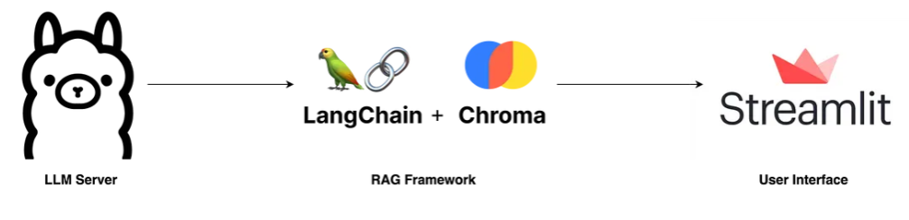
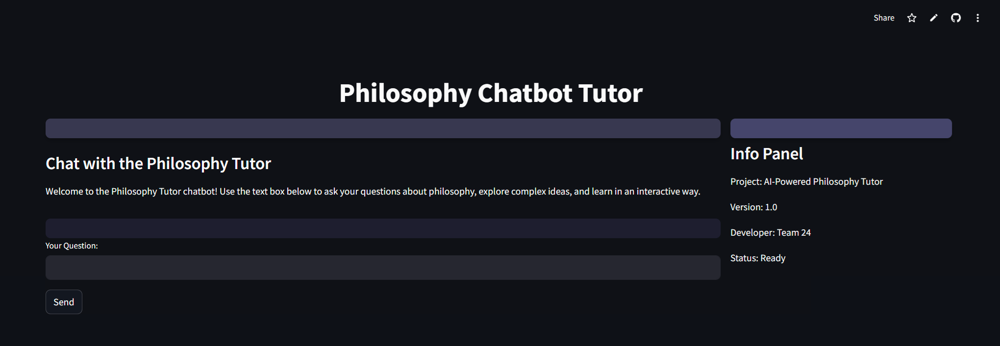

# Ai-Accelerator Program : Philosophy Chat Bot
Chatbot made to help students with philosophy made by a group of 3 for fall 2024 

Local RAG: Ollama + Langchain + Streamlit

Set up:

* Install the requirements using pip install -r requirements.txt
* Run the notebook in google colab to leverage the hosted runtime T4: https://colab.research.google.com/drive/18lcii5uk8eihIATe_hnOEV2mXNDrdoFe?usp=sharing
